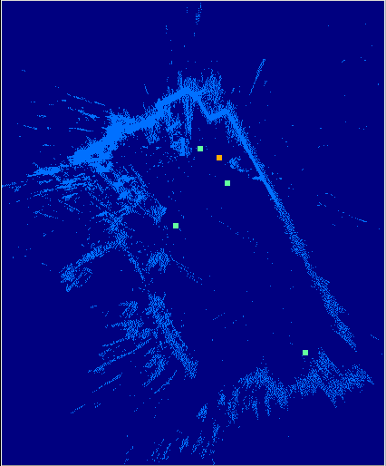
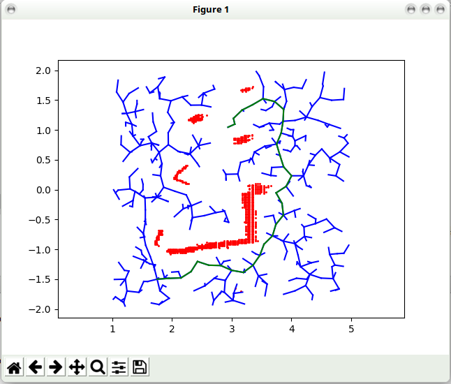
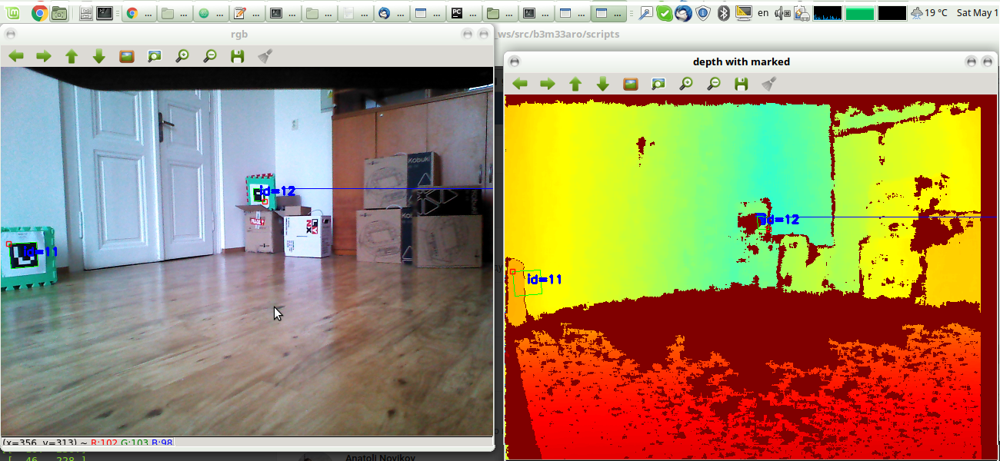

# Autonomous turtle

This is the final project for my Autonomous Robotics (b3m33aro) course at CTU in Prague: https://gitlab.fel.cvut.cz/kubelvla/b3m33aro_semestral

The project consisted of designing the perceptual, planning and navigation systems for a Kobuki TurtleBot robot equipped with a Kinect camera. The goal of the project was to detect a sequence of markers (AprilTags) and navigate the robot to each of them. We implemented the project in a team of two people with my collaborator Hanna Chaika. We used Python with a provided ROS interface. 

## Implementation

First, we use intertial odometry information to aggregate a map of the enviroment. We filter out the ground plane and store a 2d bird-view point cloud of obstacles that can look like this:

The orange point depicts the robot and the cyan points are the detected markers. The room walls can be clearly seen surrounding the robot playground.

We then used the Rapidly-exploring Random Trees (RRT) to construct a path to the next marker. Here, the obstacles are shown in red, the whole tree in blue and the selected path in green: 

Finally, the path following was done with a Proportional-Integral-Derivative controller (PID).

We tried a bunch of other stuff, including using ICP for registartion, etc. The report and the results folder describes this in more detail. We also had a simple teleoperation script that made for a lot of fun with fooling other people into thinking our robot's intelligence is far superior than theirs (we decided not to use it for the final demonstration though ;). The teleoperator view looked like this:

## Results

We got all parts of the pipeline working, and the robot correctly navigated to the target in some 50% of cases. In conclusion, the course was definitely worth it and I learned a lot from it!
